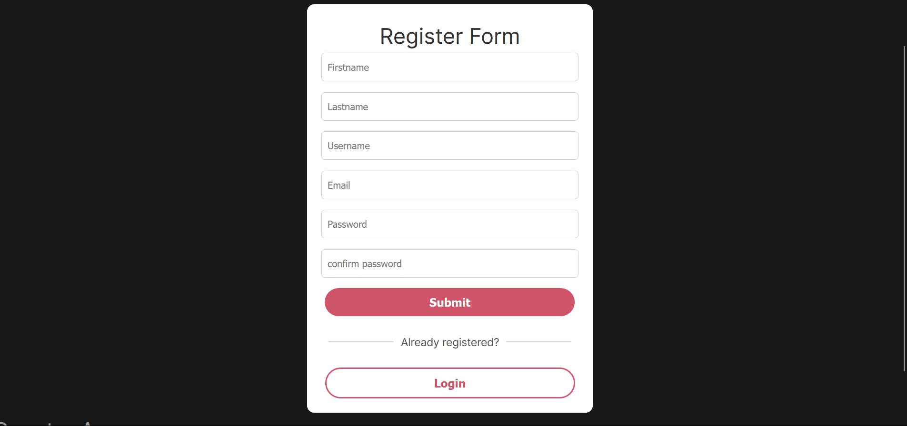
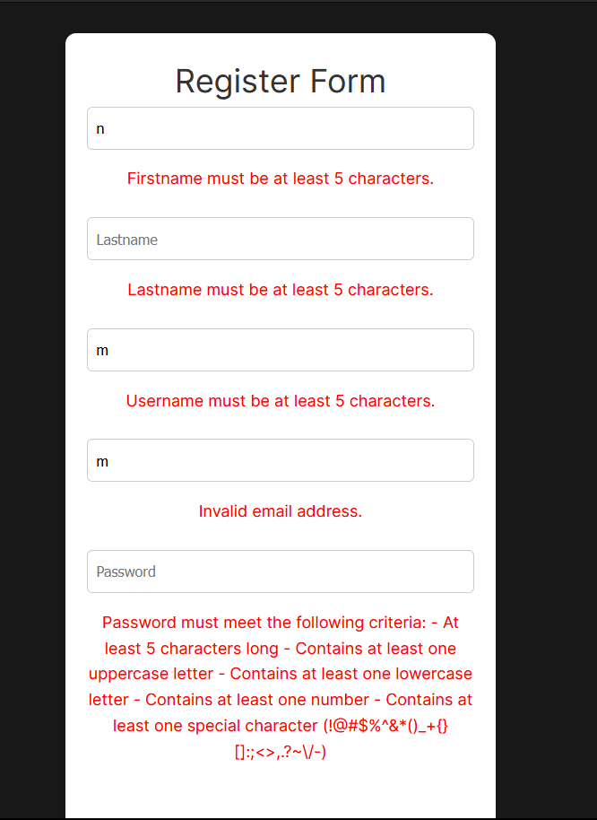

## VUE JS AUTHENTICATION SYSTEM

## DESCRIPTION :
The Vue Authentication System is a web application designed to provide user authentication features, including signup, login, and password recovery functionalities.
## NAV

## SIGN UP

## VALIDATION 

## TECHNOLOGIES USED: 
    Vue.js: Frontend framework for building interactive user interfaces and managing application state.
    Vue Router: Library for managing application routes and navigation between different pages.
    Axios: HTTP client for making asynchronous requests to the backend server.
    Node.js/Express.js: Backend framework for building the server-side logic and APIs.
    Mysql: database for storing user data securely.
